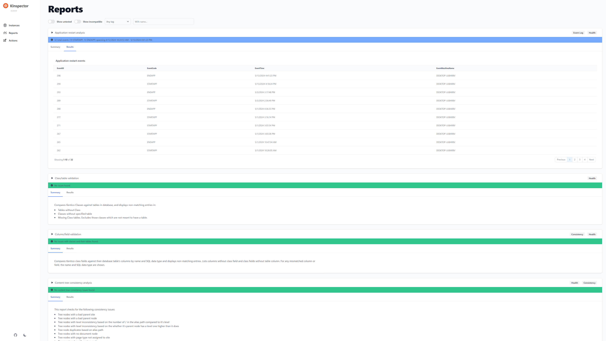

# KInspector

## Description

KInspector is an application for analyzing the health, performance and security of **[Kentico EMS](https://www.kentico.com/)** solutions.

The application is Kentico version agnostic and has no dependencies on version-specific DLLs. Most modules are designed to support Kentico 12 and 13, but some will work on older versions as well.

## Quick Start

Download the [latest release](https://github.com/kentico-ericd/kinspector-blazor/releases/latest) and extract the contents to a local directory. Run `KenticoInspector.WebApplication.exe` and open your browser to either https://localhost:5001 or http://localhost:5000.

You can optionally register the application in IIS. This allows you to have the tool always available, for example, on a development server. Point your IIS directory to the folder where you extracted everything to and make sure the application pool's .NET CLR version is set to `No managed code`. Open the site in your browser.

## Full Instructions

View the [Usage Guide](./docs/Usage-Guide.md) for more detailed instructions.

## Contributing

To see the guidelines for Contributing to Kentico open source software, please see [Kentico's `CONTRIBUTING.md`](https://github.com/Kentico/.github/blob/main/CONTRIBUTING.md) for more information and follow the [Kentico's `CODE_OF_CONDUCT`](https://github.com/Kentico/.github/blob/main/CODE_OF_CONDUCT.md).

Instructions and technical details for contributing to **this** project can be found in [Contributing Setup](./docs/Contributing-Setup.md).

## Support

This project has **Kentico Labs limited support**. See [`SUPPORT.md`](https://github.com/Kentico/.github/blob/main/SUPPORT.md#full-support) for more information.

For any security issues see [`SECURITY.md`](https://github.com/Kentico/.github/blob/main/SECURITY.md).
